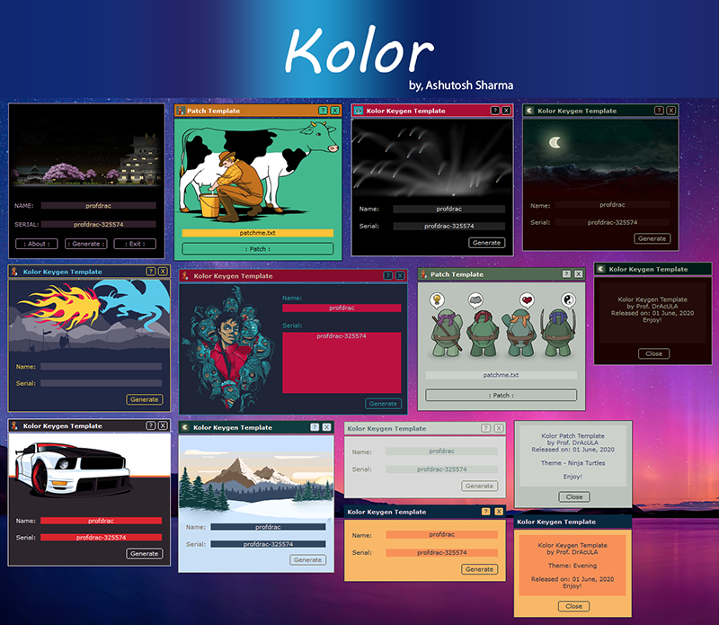

# Kolor
 A GUI framework in Assembly-Language (Masm32) for creating custom GUI for Keygens/Patchers.
 Though thats not a requirement, it can be used on any app being coded using masm32.
 
 Have a great time, fellow reversers!
